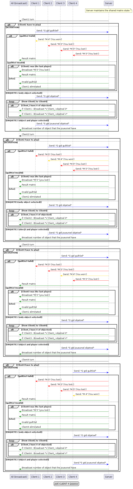

# Sherlock 13 comme jeu réseau

###### Manu Guerinel, Vasileios Filippos Skarleas

Un jeu en réseau dont le but est de comprendre les bases du protocole TCP ainsi que la communication serveur-client. Il est écrit en C et le code source a été fourni par M. Pecheux, directeur à Polytech Sorbonne.

## Dépendances

C'est un programme qui est écrit en langage C. Il y a quelques dépendances particulières pour que le program peut se compiler et tourner.

- SDL
- SDL_image
- SDL_ttf
- netdb
- netinet

Si vous avez pas la librairie SDL, vous pouvez le télécharger en utilisant le package manager Brew:

```bash
brew install sdl2
```

## Comment exécuter ?

### Lancement manuel

> Il faut noter que le program était développé sur un ordinateur Mac. Ça veut dire que toutes les instructions suivantes sont optimisées pour les ordinateurs Mac. Si vous utilisez un autre système d'exploitation, il faut vérifier ou sont installé les différentes librairies que le programme a besoin et qu'ils sont liste ci-dessus.

Le jeu SH13 viens avec un Makefile qui normalise les deux instructions de base suivantes :

```bash
gcc -o sh13_4 sh13_4.c -I/opt/homebrew/include/SDL2 -L/opt/homebrew/lib -lSDL2 -lSDL2_image -lSDL2_ttf -lpthread
gcc -o server_4 server_4.c
```

Donc, il suffit sur une terminale de taper `make`. A noter que le compilateur utilisé est clang. Il faut suivre les instructions sur l'écran pour lancer le server et les différents clients. Voici comment pourraient être les différentes commandes. Tous ces commandes d'exécution sont lancées chaque une sur un terminal séparé :

```bash
./server_4 32000
./sh13_4 127.0.0.1 32000 127.0.0.1 32001 P1
./sh13_4 127.0.0.1 32000 127.0.0.1 32002 P2
./sh13_4 127.0.0.1 32000 127.0.0.1 32003 P3
./sh13_4 127.0.0.1 32000 127.0.0.1 32004 P4
```

### Lancement automatique

Il faut noter que nous avons inclus un module qui vous permet le lancement du jeu directement sans passer par les étapes manuelles. Il suffit de taper sur un terminal :

```bash
chmod 777 play_macos.sh
```

Après nous pouvons lancer le script sans aucun soucis via la commande `bash play_macos.sh`. On nous laisse être guidez par les instructions inclus dans le module de lancement automatique.

> Il faut noter que le jeu était développé pour les machines Mac. Le cœur est écrit en C et il peut être exécuté dans n'importe quelle machine qui pourrait compiler C, mais le script automatique fait appel aux appels systèmes spécifiques pour Mac.

**Si vous êtes sur Linux, il faut utiliser le script `bash play_linux.sh` et il faut vérifier que sur Makefile le compilateur est GCC et pas CLANG. **

## Le jeu Sherlock 13

Dans Sherlock 13, les joueurs prennent le rôle de détective, essayant de démasquer le célèbre voleur Arsène Lupin, qui est parmi eux, déguisé.

Le jeu se compose de 13 cartes de personnage, avec 2 à 3 caractéristiques. Chaque caractéristique est partagée avec 3 à 5 autres personnages.

## Règles

Le serveur mélange les 13 cartes du jeu puis en distribué 12 équitablement entre tous les joueurs :

* 4 cartes à 3 joueurs
* 3 cartes à 4 joueurs

Chaque joueur ne voit que les cartes qui lui ont été distribuées (affichage sur la droite de la fenêtre).

Le serveur connait les cartes de chaque joueur, et crée une grille en comptabilisant le nombre de symbole que chaque joueur a. Ainsi il va envoyer à chaque joueur la ligne qui lui correspond et uniquement celle-ci.

Le tour de jeu s'effectue dans l'ordre des connexions de chaque joueur. Chaque joueur va devoir collecter des informations pour identifier le criminel. A son tour, chaque joueur choisit une action :

1. ACCUSATION : Choisissez le personnage que vous pensez être le criminel parmi la liste du tableau en bas à gauche puis cliquez sur le bouton "send".

* Si vous avez raison et que le personnage désigné est le 13ème personnage alors la partie est finie et vous avez remporté la partie.
* Si ce n'est pas le bon personnage, vous êtes éliminé et jusqu'à la fin de la partie, votre tour sera sauté, mais les autres joueurs peuvent toujours poser des questions sur vos cartes.

1. ENQUÊTE 1 : Choisissez un symbole puis cliquez sur le bouton "send". Cela demande à tous les joueurs s’ils ont ou non ce symbole parmi leurs cartes. Le serveur remplit à tout le monde la colonne correspondant au symbole sélectionné de la grille, avec un V si le joueur possède au moins un de ce symbole et 0 s’il n'en possède pas. A noter que le serveur ne donne pas la réponse correspondant au joueur courant.
2. ENQUÊTE 2 : Choisissez un joueur et un symbole spécifique puis cliquez sur le bouton "send". Le serveur répond à la place du joueur désigné, et donne à tous les autres joueurs le nombre exact de symboles qu'il possède.

La partie se termine donc lorsqu'un joueur réussit une accusation OU lorsque tous les joueurs ont raté leur accusation et à ce moment, tout le monde a perdu la partie.

## Architecture

### Relation serveur/clients

1. Il y a un serveur central qui connait toutes les informations. C'est lui qui va mélanger les cartes et les distribuer aux joueurs une fois que tout le monde est connecté sur la session du jeu. En plus, c'est lui qui est responsable de répondre aux questions que les joueurs posent aux autres joueurs. Par exemple, selon le type de la question, il faut donner les corrects informations et faire attentions de pas transmettre des informations que les joueurs n'ont pas demande ou ils sont hors des règles du jeu. Il s'agit du fichier server.c
2. Il y a 4 clients qui vont joueurs. Tous les 4 clients partage le même source code qu'il s'agit du fichier sh13.c. Chaque personne qui essaye de se connecter au server central faut donner les informations suivantes

   * Son adresse IP
   * La port utilise pour communiquer avec le client en question
   * Son nom

   Le serveur envoie un message de confirmation une fois qu'il a accepté le client. Si tous les 4 clients sont connectés alors la boucle principale du jeu peu commencer (poser des questions et faire de Guess pour la carte caché). Voici un schéma UML de l'architecture réseau du jeu Sherlock 13.


#### Nota bene

> Nous sommes en protocole TCP, ça veut dire que chaque fois qu'une information est envoyé au réseau, le destinataire doit informer l'émetteur pour la réception de message. Donc en niveau UML, il s'agit d'un acknowledge du côté serveur. C'est un comportement qui se répète dans tous les différents niveaux du programme comme la connexion des clients, la réception des cartes, deviner la carte cache, ou même poser des questions.

### La boucle du jeu

Comme dans chaque jeu, on joue dans une boucle infinie jusque que quelqu'un gagne (ou si on abandonne parce qu'il y a plus d'intérêt :]). On peut observer le même comportement au cœur de notre program.

Une fois que toutes les initialisations nécessaires sont fait comme ceux ci-dessous, on peut commencer le jeu :

* Connexion des tous les 4 clients
* Mélange des cartes
* Distribution de 3 cartes à chaque client
* Envoi des informations aux clients telles que les détails de leurs cartes et les noms des autres joueurs.

Vous allez trouver à la ligne 260 du source code des clients (sh13.c) un while qui va se terminer si et seulement si l'interface graphique SDL est quitté `while (!quit)`. C'est dans cette boucle while que chaque utilisateur peut poser ses questions :

* Soit, à tous les joueurs, "Qui a (au moins un) de (cette caractéristique) ?
* Soit, pour un joueur spécifique, "Combien de (cette caractéristique) avez-vous ?

Chaque jouer à une tentative de deviner la carte cache comme explique aux règles du jeu. Si jamais quelqu'un trouve cette carte, tous les autres perdent. En termes de réseau, on communique qui a gagné et qui a perdu jusque ce moment ou pas, ainsi que qui est le gagnant. Voici un schéma UML qui montre les messages envoyés par le serveur vers les clients dans les différents scenarios qu’un client x a deviné ou pas la bonne carte :



## Explications

### Quel est l'intérêt d'utiliser Threads pour connecter les clients ?

Notre jeu s'agit d'un jeu réseau et donc dans ce cadre-là le serveur n'aura pas la même adresse IP avec les clients qui se connecte pour jouer car sur le réseau internet chaque utilisateur est unique (adresse IP unique). Cependant, pour être capable de tester les différents fonctionnalités et messages envoyé par les clients et le serveur, nous travaillons sur la même machine que les clients et le serveur tournent. Ainsi tout le monde aura la même adresse IP. Donc, la seule manière de les différencier est donc d'utiliser des ports spécifiques attribués à chaque client.

Ainsi l'intérêt d'utiliser des threads sont les suivantes :

1. Les threads permettent au serveur de gérer plusieurs clients en parallèle. Chaque client est associé à un thread distinct, ce qui permet au serveur de continuer à écouter et accepter de nouvelles connexions pendant qu'il traite les messages des clients existants.
2. Permettent de séparer les tâches réseau (comme écouter et recevoir des messages) des tâches de traitement ou d'affichage, le programme reste réactif et efficace. Par exemple, le serveur peut continuer à recevoir des données sans être bloqué par le traitement graphique ou autre.
3. Chaque thread peut se concentrer sur une tâche spécifique. Par exemple :
   * Un thread pour le serveur TCP (écoute et réception des messages réseau).
   * Un thread pour l'affichage graphique des messages ou des mises à jour.
   * Des threads supplémentaires pour gérer des calculs lourds ou d'autres fonctionnalités spécifiques du jeu.

### Pourquoi on utilise volatile pour la variable synchro sur sh13.c ?

On observe que la variable synchro est déclaré comme volatile, mais c'est quoi exactement l'intérêt ?

On ne peut pas se fier à la valeur de `synchro` lors d'une lecture classique de la variable en question. L'objectif n'est pas de vérifier la valeur mise en cache par le processeur, mais de consulter directement la valeur réelle de `synchro`, qui est mise à jour dans deux threads distincts :

* **Côté réseau** : le serveur TCP.
* **Côté graphique** : le module d'affichage.

Vous pouvez trouver plus d'informations sur cette variable synchro ci-dessous :

### La variable *synchro*

La variable `synchro` sert de mécanisme de communication et de coordination entre les deux threads distincts (réseau et graphique). Elle permet de signaler à l'un des threads (par exemple, le module graphique) que l'autre thread (le serveur TCP) a reçu un message.

Cette synchronisation est essentielle dans les cas suivants :

1. **Éviter des conflits d'accès** : Lorsque deux threads partagent une même donnée (ici, `synchro`), il est important de savoir si l'état de la variable est cohérent. En utilisant une variable volatile, on s’assure que les lectures/écritures accèdent directement à la mémoire principale, et non à une copie potentiellement obsolète stockée dans le cache du processeur.
2. **Optimiser le traitement** : Avec `synchro`, le thread graphique n’a pas besoin de vérifier en permanence si un nouveau message est arrivé. Il peut réagir efficacement dès que `synchro` indique la réception d’un message.
3. **Séparation des responsabilités** : Cette approche isole les fonctions de réception de messages (thread réseau) et de traitement/affichage des messages (thread graphique), améliorant ainsi la clarté et la maintenabilité du code.

### Qu’est qu'il se passe sur le second paramètre quand on fait l'appel system listen ?

### Comment trouver le prochain jouer ?

Nous avons établi une fonction pour trouver le prochain jouer dans le cas où nous sommes dans un jeu de 3 ou 4 joueurs.

```c

int joueur_suivant(int joueurCourant, int *liste_joueurs_elimines)
{
	char buffer[256];
	int hold_joueurCourant = joueurCourant;

	do
	{
		joueurCourant = (joueurCourant + 1) % 3;

		if (joueurCourant == hold_joueurCourant)
		{
			for (int i = 0; i < 3; i++)
			{
				for (int j = 0; j < 8; j++)
				{
					sprintf(buffer, "V %d %d %d", i, j, tableCartes[i][j]);
					broadcastMessage(buffer);
				}

				return 4;
			}
		}
	} while (liste_joueurs_elimines[joueurCourant] == 1);

	sprintf(buffer, "M %d", joueurCourant);
	broadcastMessage(buffer);

	return joueurCourant;
}
```

Dans une boucle `do...while`, la fonction cherche le joueur suivant en incrémentant la valeur de `joueurCourant` de manière circulaire. Le modulo permet de revenir au premier joueur après le dernier (par exemple, après le joueur 2, elle repasse au joueur 0). Si le joueur trouvé n'est pas éliminé, la boucle s'arrête. Enfin, la fonction retourne le numéro du joueur suivant, permettant au programme principal de continuer avec ce joueur.

Cette fonctionne est essentielle car il nous permet de trouver le prochain jouer si quelqu'un a perdu ou encore quand nous sommes dans la partie de poser des questions, il faut toujours trouver le prochain jouer.

### La logique de terminer le jeu

Dès le début du jeu, nous avons une liste laquelle va contenir l'état de joueurs. Si jamais quelqu’un est à 0 ça veut dire qu'il est vivant, sinon il était éliminé. Alors, si jamais tout le monde est à 1, donc on va fermer le serveur parce que tout le monde a perdu.

Maintenant, on se pose la question comment on décide si quelqu’un est mort ou vivant.

## Changements essentiels

Dans cette partie vous allez trouver quelques changements et modifications qui était apporté sur le code et qui étaient essentiels pour le bon fonctionnement du programme :

1. `bcopy((char *)server->h_addr, (char *)&serv_addr.sin_addr.s_addr, server->h_length); `

   La fonction bcopy a la ligne 116 du fichier sh13.c est utilisée pour copier l'adresse IP de la structure du serveur vers la structure serv_addr. Cela permet de définir l'adresse IP du serveur auquel le client se connectera. Il s'agit d'une connexion TCP entre le client et le serveur.

   Le client crée d'abord un socket, puis il lie le socket à un port local, puis il tente de se connecter à l'adresse IP et au numéro de port du serveur.

   Cependant, il est important de noter que l'utilisation de bcopy a été aboli. Voici comment on obtiens le même comportement avec la fonction memcpy: `memcpy((char *)&serv_addr.sin_addr.s_addr, server->h_addr_list[0], server->h_length);`
2. Le server n'était pas capable de mélanger les cartes parce qu'il n'y avait un endroit ou le générateur aléatoire était initialise avec l'heur actuel de la machine. Donc la commande `srand(time(NULL));` était ajoute au fichier server.c a la ligne 278.

## Améliorations

Il y a toujours des améliorations qu'on pourrait apporter au projet. Voici nos idées :

* [ ] Détecter si un utilisateur déconnecté par la session et informer les autres. Si il est reconnecte, il puissent continuer le jeu
* [ ] Développer un codec de sauvegarde de l'état du jeu et donner la capacite aux jouers de sauvegarder leur jeu.
* [ ] Possibilité de mettre à jour le username d'un client après la connexion pour offrir encore plus des possibilités de customisation
* [X] Pouvoir joueur en 3 joueurs (donc 4 cartes par joueur)

## Versions

Le versioning est un élément clé en programmation, assurant la cohérence des modifications et facilitant la collaboration. Il est aussi primordial pour la récupération de données en cas de perte ou corruption. Au fil du projet, nous avons créé différentes versions de notre code, chacune marquant une étape importante de son évolution. Cela nous a permis de suivre les progrès, d'intégrer de nouvelles fonctionnalités et d'effectuer des corrections de manière structurée.

* V1.0.0: Récupérer les fichiers source du jeu
* V1.2.1: Création du git de la structure de base [initial commit]
* V1.2.3: sh13.c était complété
* V2.0.1: server.c était complété [added server]
* V3.0.1: Reconstruction du répertoire, changement de la police, nettoyage, création du makefile, première version du compte rendu, changement du background vers une image.
* V3.1.0: Mise a jour du source code
* V4.0.0: Correction sur la réalisation de règles (message S niveau serveur)
* V4.0.1: Mise a jour d'UML
* V5.0.1: Added aytomatic installation script for macos and linux
* V5.0.2: Added more details on README
