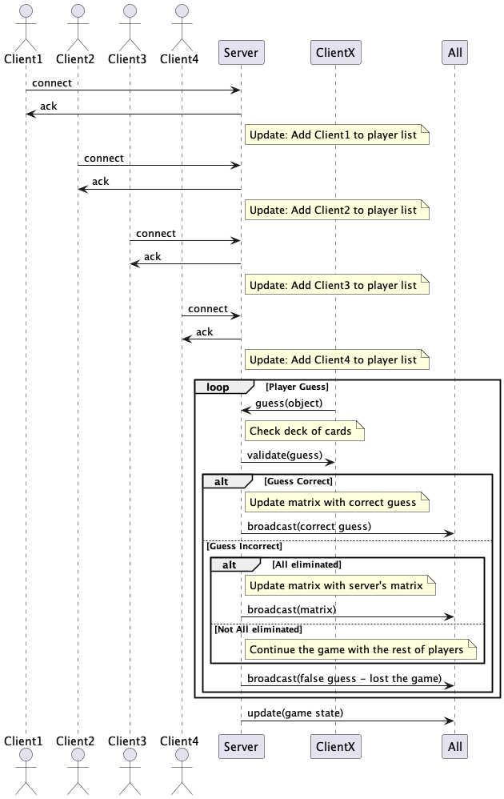
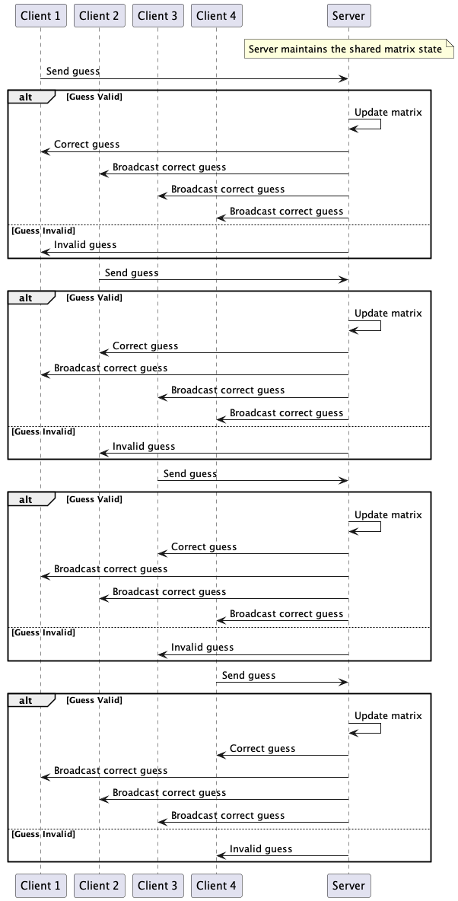

# Sherlock 13 comme jeu réseau

###### Manu Guerinel, Vasileios Filippos Skarleas

Un jeu en réseau dont le but est de comprendre les bases du protocole TCP ainsi que la communication serveur-client. Il est écrit en C et le code source a été fourni par M. Pecheux, directeur à Polytech Sorbonne.

## Dépendances

C'est un programme qui est écrit en langage C. Il y a quelques dépendances particuliers pour que le program peut se compiler et tourner.

- SDL
- SDL_image
- SDL_ttf
- netdb
- netinet

Si vous avez pas la librairie SDL, vous pouvez le télécharger en utilisant le package manager Brew:

```bash
brew install sdl2
```

## Comment exécuter ?

### Lancement manuel

> Il faut noter que le program était développé sur un ordinateur Mac. Ça veut dire que toutes les instructions suivantes sont optimisées pour les ordinateurs Mac. Si vous utilisez un autre système d'exploitation, il faut vérifier ou sont installé les différentes librairies que le programme a besoin et qu'ils sont liste ci-dessus.

Le jeu SH13 viens avec un Makefile qui normalise les deux instructions de base suivantes :

```bash
gcc -o sh13_4 sh13_4.c -I/opt/homebrew/include/SDL2 -L/opt/homebrew/lib -lSDL2 -lSDL2_image -lSDL2_ttf -lpthread
gcc -o server_4 server_4.c
```

Donc, il suffit sur une terminale de taper `make`. A noter que le compilateur utilisé est clang. Il faut suivre les instructions sur l'ecran pour lancer le server et les differents clients. Voici comment pourraient etre les differents commandes. Tous ces commandes d'executiosn sont lanché chaque une sur un terminal separe:

```bash
./server_4 32000
./sh13_4 127.0.0.1 32000 127.0.0.1 32001 P1
./sh13_4 127.0.0.1 32000 127.0.0.1 32002 P2
./sh13_4 127.0.0.1 32000 127.0.0.1 32003 P3
./sh13_4 127.0.0.1 32000 127.0.0.1 32004 P4
```

### Lancement automatique

Il faut noter que nous avons inclus un module qui vous permet le lancement du jeu directement sans passer par les etapes manuels. Il suffit de tapper sur un terminal:

```bash
chmod 777 play_macos.sh
```

Apres nous pouvons lancher le script sans aucun soucis via la commande `bash play_macos.sh`. On nous laise etre guidez par les instructions inclus dans le module de lancement automatique.

> Il faut noter que le jeu etait develope pour les machines Mac. Le coeur est ecrit en C et il peut etre execute dans n'importe quel machine qui pourrait compiler C, mais le script automatique fait appel aux appels systemes specifiques pour Mac.

**Si vous etes sur Linux, il faut utiliser le script `bash play_linux.sh` et il faut verifier que sur Makefile le compilateur est GCC et pas CLANG.**

## Le jeu Sherlock 13

Dans Sherlock 13, les joueurs prennent le rôle de détective, essayant de démasquer le célèbre voleur Arsène Lupin, qui est parmi eux, déguisé.

Le jeu se compose de 13 cartes de personnage, avec 2 à 3 caractéristiques. Chaque caractéristique est partagée avec 3 à 5 autres personnages.

## Règles

Les cartes sont mélangées et l'une est mise de côté. Cette carte représente le déguisement choisi par Arsène Lupin, les autres cartes sont réparties parmi les joueurs.

Les joueurs comptent alors le total des caractéristiques qu'ils ont sur leurs cartes (par exemple, 2 détectives, 1 femme, 0 génie, etc.) et vont pouvoir poser une de ces deux questions pour recueillir de nouvelles preuves :

* Soit, à tous les joueurs, "Qui a (au moins un) de (cette caractéristique) ?
* Soit, pour un joueur spécifique, "Combien de (cette caractéristique) avez-vous ?

En utilisant ces indices, les joueurs tentent de déterminer quel déguisement Arsène a choisi (c'est-à-dire quelle carte est manquante).

Au lieu d'une question, un joueur peut annoncer quel personnage il soupçonnera d'être Arsène déguisé. Ce joueur vérifie en secret la carte cachée. Si le soupçon était correct, ce joueur gagne le jeu, sinon le joueur est éliminé et les autres joueurs continuent.

## Architecture

### Relation serveur/clients

1. Il y a un server central qui connait toutes les informations. C'est lui qui va mélanger les cartes et les distribuer aux joueurs une fois que tout le monde est connecté sur la session du jeu. En plus, c'est lui qui est responsable de répondre aux questions que les joueurs posent aux autres joueurs. Par exemple, selon le type de la question, il faut donner les corrects informations et faire attentions de pas transmettre des informations que les joueurs n'ont pas demande ou ils sont hors des règles du jeu. Il s'agit du fichier server.c
2. Il y a 4 clients qui vont joueurs. Tous les 4 clients partage le même source code qu'il s'agit du fichier sh13.c. Chaque personne qui essaye de se connecter au server central faut donner les informations suivantes

   * Son adresse IP
   * La port utilise pour communiquer avec le client en question
   * Son nom

   Le serveur envoie un message de confirmation une fois qu'il a accepté le client. Si tous les 4 clients sont connectés alors la boucle principale du jeu peu commencer (poser des questions et faire de Guess pour la carte caché). Voici un schéma UML de l'architecture réseau du jeu Sherlock 13.



#### Nota benne

> Nous sommes en protocol TCP, ca veut dire que chaque fois qu'une information est envoyé au reseau, le destinataire doit informer l'emmeteur pour la reception de message. Donc en niveau UML, il s'agit d'un acknowledge du cote serveur. C'est un comportement qui se repete dans tous les differents niveaux du programm comme la connection des clients, la reception des cartes, deviner la carte cache, ou meme posser des questions.

### La boucle du jeu

Comme dans chaque jeu, on joue dans une boucle infinie jusque que quelqu'un gagne (ou si on abandonne parce qu'il y a plus d'intérêt :]). On peut observer le même comportement au cœur de notre program.

Une fois que tous les initialisations nécessaires sont fait comme ceux ci-dessous, on peut commencer le jeu :

* Connexion des tous les 4 clients
* Mélange des cartes
* Distribution de 3 cartes à chaque client
* Envoi des informations aux clients telles que les détails de leurs cartes et les noms des autres joueurs.

Vous allez trouver à la ligne 260 du source code des clients (sh13.c) un while qui va se terminer si et seulement si l'interface graphique SDL est quitté `while (!quit)`. C'est dans cette boucle while que chaque utilisateur peut poser ses questions :

* Soit, à tous les joueurs, "Qui a (au moins un) de (cette caractéristique) ?
* Soit, pour un joueur spécifique, "Combien de (cette caractéristique) avez-vous ?

Chaque jouer à une tentative de deviner la carte cache comme explique aux règles du jeu. Si jamais quelqu'un trouve cette carte, tous les autres perdent. En termes de réseau, on communique qui a gagné et qui a perdu jusque ce moment ou pas, ainsi que qui est le gagnant. Voici un schéma UML qui montre les messages envoyés par le serveur vers les clients dans les différents scenarios qu’un client x a deviné ou pas la bonne carte :



## Explications

### Pourquoi nous utilisons de Threads ?

Notre jeu s'agit d'un jeu resseau et donc dans ce cadre la le serveur n'aura pas la meme addresse IP avec les clients qui se connect pour jouer car sur le resseau internet chaque utilisateur est unique (adresse IP unique). Par contre, pour etre capable de tester les differents fonctionalites et messages envoye par les clienst et le serveur, nous travaillons sur la memem machine que les clients et le serveur tournet. Ainsi tout le monde aura la meme adresse IP. Donc, la seule manière de les différencier est donc d'utiliser des **ports spécifiques** attribués à chaque client.

Ainsi l'interet d'utiliser des threads sont les suivantes:

1. Les threads permettent au serveur de gérer plusieurs clients en parallèle. Chaque client est associé à un thread distinct, ce qui permet au serveur de continuer à écouter et accepter de nouvelles connexions pendant qu'il traite les messages des clients existants.
2. Permettent de séparer les tâches réseau (comme écouter et recevoir des messages) des tâches de traitement ou d'affichage, le programme reste réactif et efficace. Par exemple, le serveur peut continuer à recevoir des données sans être bloqué par le traitement graphique ou autre.
3. Chaque thread peut se concentrer sur une tâche spécifique. Par exemple :
   * Un thread pour le serveur TCP (écoute et réception des messages réseau).
   * Un thread pour l'affichage graphique des messages ou des mises à jour.
   * Des threads supplémentaires pour gérer des calculs lourds ou d'autres fonctionnalités spécifiques du jeu.

### Pourquoi on utilise volatile pour la variable synchro sur sh13.c ?

On observe que la variable synchro est declare comme volatile, mais c'est quoi exactement l'interet ?

On ne peut pas se fier à la valeur de `synchro` lors d'une lecture classique de la variable en question. L'objectif n'est pas de vérifier la valeur mise en cache par le processeur, mais de consulter directement la valeur réelle de `synchro`, qui est mise à jour dans deux threads distincts :

* **Côté réseau** : le serveur TCP.
* **Côté graphique** : le module d'affichage.

Vous pouvez trouver plus d'informations sur cette variable synchro ci-dessous:

### La variable *synchro*

La variable `synchro` sert de mécanisme de communication et de coordination entre les deux threads distincts (réseau et graphique). Elle permet de signaler à l'un des threads (par exemple, le module graphique) que l'autre thread (le serveur TCP) a reçu un message.

Cette synchronisation est essentielle dans les cas suivants :

1. **Eviter des conflits d'accès** : Lorsque deux threads partagent une même donnée (ici, `synchro`), il est important de savoir si l'état de la variable est cohérent. En utilisant une variable volatile, on s’assure que les lectures/écritures accèdent directement à la mémoire principale, et non à une copie potentiellement obsolète stockée dans le cache du processeur.
2. **Optimiser le traitement** : Avec `synchro`, le thread graphique n’a pas besoin de vérifier en permanence si un nouveau message est arrivé. Il peut réagir efficacement dès que `synchro` indique la réception d’un message.
3. **Séparation des responsabilités** : Cette approche isole les fonctions de réception de messages (thread réseau) et de traitement/affichage des messages (thread graphique), améliorant ainsi la clarté et la maintenabilité du code.

### Quel est l'interet d'utiliser Threads pour connecter les clients ?

ccc

### Quest qu'il se passe sur le second parametre quand on fait l'appel system listen ?


### Comment trouver le prochain jouer ?

ccc

### La logic de terminer le jeu 

Expliquer le truc for all_users_eliminated

## Changements essentiels

Dans cette partie vous allez trouver quelques changements et modifications qui était apporte sur le code et qui étaient essentiels pour le bon fonctionnement du programme:

1. `bcopy((char *)server->h_addr, (char *)&serv_addr.sin_addr.s_addr, server->h_length); `

   La fonction bcopy a la ligne 116 du fichier sh13.c est utilisée pour copier l'adresse IP de la structure du serveur vers la structure serv_addr. Cela permet de définir l'adresse IP du serveur auquel le client se connectera. Il s'agit d'une connexion TCP entre le client et le serveur.

   Le client crée d'abord un socket, puis il lie le socket à un port local, puis il tente de se connecter à l'adresse IP et au numéro de port du serveur.

   Cependant, il est important de noter que l'utilisation de bcopy a été aboli. Voici comment on obtiens le même comportement avec la fonction memcpy: `memcpy((char *)&serv_addr.sin_addr.s_addr, server->h_addr_list[0], server->h_length);`
2. Le server n'était pas capable de mélanger les cartes parce qu'il n'y avait un endroit ou le générateur aléatoire était initialise avec l'heur actuel de la machine. Donc la commande `srand(time(NULL));` était ajoute au fichier server.c a la ligne 278.

## Ameliorations

Il y a toujours des améliorations qu'on pourrait apporter au projet. Voici nos idées:

* [ ] Détecter si un utilisateur déconnecté par la session et informer les autres. Si il est reconnecte, il puissent continuer le jeu
* [ ] Développer un codec de sauvegarde de l'état du jeu et donner la capacite aux jouers de sauvegarder leur jeu.
* [ ] Possibilité de mettre à jour le username d'un client après la connexion pour offrir encore plus des possibilités de customisation
* [X] Pouvoir joueur en 3 joueurs (donc 4 cartes par joueur)

## Versions

Le versioning est un élément clé en programmation, assurant la cohérence des modifications et facilitant la collaboration. Il est aussi primordial pour la récupération de données en cas de perte ou corruption. Au fil du projet, nous avons créé différentes versions de notre code, chacune marquant une étape importante de son évolution. Cela nous a permis de suivre les progrès, d'intégrer de nouvelles fonctionnalités et d'effectuer des corrections de manière structurée.

* V1.0.0: Récupérer les fichiers source du jeu
* V1.2.1: Création du git de la structure de base [initial commit]
* V1.2.3: sh13.c était complété
* V2.0.1: server.c était complété [added server]
* V3.0.1: Reconstruction du répertoire, changement de la police, nettoyage, création du makefile, premier version du compte rendu, changement du background vers une image.
* V3.1.0: Mise a jour du source code
* V4.0.0: Correction sur la realisation de regles (message S niveau serveur)
* V4.0.1: Mise a jour d'UML
* V5.0.1: Added aytomatic installation script for macos and linux
